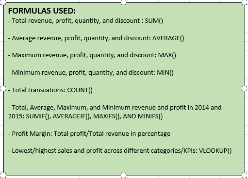

# US SUPERSTORE SALES ANALYSIS

## Introduction
This is an Excel project focusing on analysing the **"USA Superstore"** sales data from 2014 to 2017 to identify trends, unravel patterns, provide answers to business questions, make predictions and projections, and guide the company to make informed business decisions. The dataset used was downloaded from the internet for this analysis.

## Business Questions
1. What is the sales trend over time? Are there seasonal patterns or specific periods of growth or decline?
2. Can you identify different customer segments that generate the most profits and sales? How can you tailor marketing and sales strategies for each group?
3. How do sales vary across different cities? Are there cities with unusually low or high sales? What factors contribute to this?
4. What is the total quantity of products sold in all the product sub-categories in all years?
5. What is the total profit for each year? Are there any observable patterns? 
6. What are the top (2) performing products across all years?

## Key Performance Indicators (KPIs)
- Created and computed KPIs which included the following: Total, Average, Min, and Max of the Revenue, Profit, Quantity Sold, and Discount; Profit Margin, Total and Average Profit and Revenue for years 2014 and 2015
- Computed the cities, product IDs, Regions, years, product categories, and customers who purchased, the lowest and highest sales and profits.
- These are shown below:

- 

## Skills Demonstrated And Formulas Used:
The following Excel formulas and functions were used
- Conditional formatting
- Text to column
- Sort and filter
- Find and select
- Data type formatting
- Pivot tables and charts
- Functions e.g. [LEFT(), RIGHT(), TEXT(DATE(yy,mm,dd), CONCATNATE()]

## Analysis And Visualization:
The analysis of the data was done and visualizations were created. These were aimed at answering the business questions.

### 1. Demonstrating sales trend over time and seasonal periods of growth or decline:
From the Line Chart below, the year starts with low sales between January and february. Sales increase in March and stays fairly constant (with little to no rise/fall) from April until August. Then comes the spike. There appears to be a yearly peak in sales from September to December. Even though there is a sharp decline in sales in October, sales can be seen to peak again as the year ends. This could be attributed to the festivities like Thanksgiving, Haloween, Christmas, etc. around each year end. With this insight, the procurement team can make better inventory and stocking decisions throughout the year.

### 2. Identifying different customer segments that generate the most profits and sales:
Upon observing the Pie and Doughnut charts below, the "Consumer Segment" of the customers are seen to generate the most revenue and profits for the company. The least revenue and profits are generated by the "Home Office" customer segment.This information can help the company with their Economic Order Quantity. Marketing and sales strategies can be tailored differently for each group/segment of customers. Attention should be given to the category of products that appeal to the Consumer Segment to ensure that they are readily available for purchase and there are no Out of Stocks. Inventory for products purchased by the Home Office Segment of customers can be properly reviewed and mmanaged to avoid overstocking.

