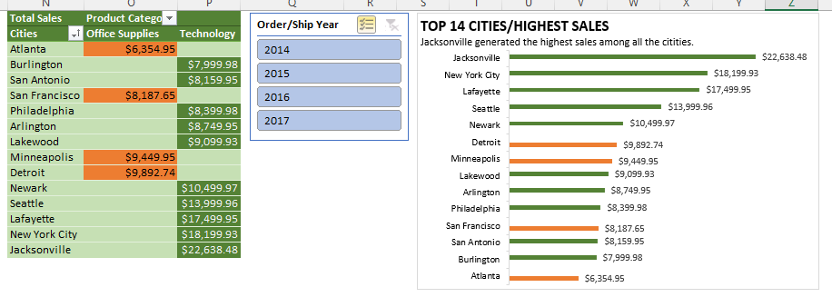

# U.S.A SUPERSTORE SALES ANALYSIS

## Introduction
This is an Excel project focusing on analysing the **"USA Superstore"** sales data from 2014 to 2017 to identify trends, unravel patterns, provide answers to business questions, make predictions and projections, and guide the company to make informed business decisions. The dataset used was downloaded from the internet for this analysis.

## Business Questions
1. What is the sales trend over time? Are there seasonal patterns or specific periods of growth or decline?
2. Can you identify different customer segments that generate the most profits and sales? How can you tailor marketing and sales strategies for each group?
3. How do sales vary across different cities? What cities generated high sales? What factors contributed to this?
4. What is the total quantity of products sold in all the product sub-categories in all years?
5. What is the total profit for each year? Are there any observable patterns? Can you make any projections for 2018?
6. What are the top (2) performing products across all years?
7. Can you identify the top 5 sales across all years and their profitability? Are there any concerns or observations?

## Key Performance Indicators (KPIs)
- Created and computed KPIs which included the following: Total, Average, Min, and Max of the Revenue, Profit, Quantity Sold, and Discount; Profit Margin, Total and Average Profit and Revenue for years 2014 and 2015
- Computed the cities, product IDs, Regions, years, product categories, and customers who purchased, the lowest and highest sales and profits.
- These are shown below:

- 

## Skills Demonstrated And Formulas Used:
The following Excel formulas and functions were used to clean and format the data, and visualize important insights:
- Conditional formatting
- Text to column
- Sort and filter
- Find and select
- Data type formatting
- Pivot tables and charts
- [LEFT(), RIGHT(), TEXT(DATE(yy,mm,dd), CONCATNATE()]

## Analysis And Visualization:
The analysis of the data was done and visualizations were created. These were aimed at answering the business questions.

### 1. Demonstrating sales trend over time and seasonal periods of growth or decline:
From the Line Chart below, the year starts with low sales between January and february. Sales increase in March and stays fairly constant (with little to no rise/fall) from April until August. Then comes the spike. There appears to be a yearly peak in sales from September to December. Even though there is a sharp decline in sales in October, sales can be seen to peak again as the year ends. This could be attributed to the festivities like Thanksgiving, Haloween, Christmas, etc. around each year end. With this insight, the procurement team can make better inventory and stocking decisions throughout the year.

### 2. Identifying different customer segments that generate the most profits and sales:
Upon observing the Pie and Doughnut charts below, the "Consumer" segment of the customers are seen to generate the most revenue and profits for the company. The least revenue and profits are generated by the "Home Office" customer segment. This information can help the company with their Economic Order Quantity. Marketing and sales strategies can be tailored differently for each group/segment of customers. Attention should be given to the category of products that appeal to the consumer segment to ensure that these products are readily available for purchase and there are no out of stocks. Inventory for products purchased by the home office segment of customers can be properly reviewed and managed to avoid overstocking.

### 3. Varying revenue across different cities and identifying possible contributing factors:
The Bar Chart below displays the top 14 cities with the highest sales and the category of products which generated those sales. Jacksonville ranks top city with the highest revenue. It can also be observed that majority of these sales came from the Technology category of products. This could be a contributing factor to the high revenue generation in these cities. Products in the Technology category appear to have high prices, thus in cities where there are higher demands for these products, there is projected to be a corresponding high revenue recorded.

### 4. Visualizing the total quantity of products sold in all the product sub-categories across all years:
Using an Area chart, the quantities sold per product sub-category across all years were visualized. Worthy of note is the fact that the "Binders" sub-category of products consistently out-performed other sub-categories across all years, while the "Copiers" sub-category remained at the bottom, having the least quantity sold. This can help the company make better stocking decisions.

### 5. Analysing the total profit for each year, any observable patterns and projections for 2018:
Represented below by the 3D Pyramid chart is the total profit from 2014 to 2017. Clearly,there is an exponential increase in profit across all years averaging a total of 23.8% for the 3-year period. Profit in 2017 was lower than the preceeding year and factors contributing to this can be investigated. Overall, the last 3 years were profitable years and using the analysis, projections can be made for the coming year, 2018. We can predict profit to increase by an avverage of 23.8% in 2018 amounting to about $115,662.71.

## 6.  Visualizing the top (2) performing products across all years:
Shown below in the 3D Area chart are the top 2 performing products across all years. The product "Canon imageCLASS 2200 Advanced Copier" ranked best selling product with a total revenue of $53,199.85 while "Cisco TelePresence System EX90 Videoconferencing Unit" ranked 2nd best with a total revenue of $22,638.48.

## 7. identifying the top 5 sales across all years and their profitability:
Displayed in the Column chart below are the top 5 highest sales and their profitabily. 80% of the sale transactions were profitable, generating an average of 45% profit each. However, there is a noticeable 8% loss in the highest sale transaction amounting to a revenue loss of $1,811.08. Also, close investigation of the entire dataset revealed 1871 transactions with negative profits i.e losses, totalling an overall loss of ($156,131.29). Given that the overall profit generated was $286,397.02 this is a huge loss; about 45.5% of the total profit. Factors that contributed to this should be investigated and identified, and appropraite measures put in place to prevent further losses on sales across all regions.

